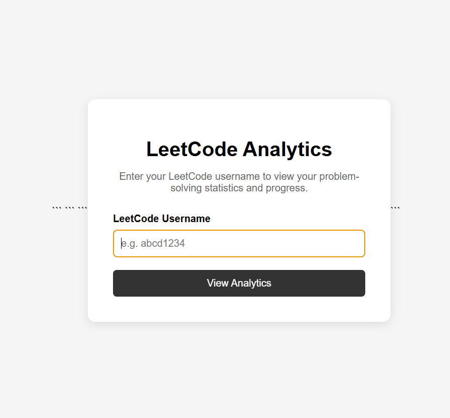
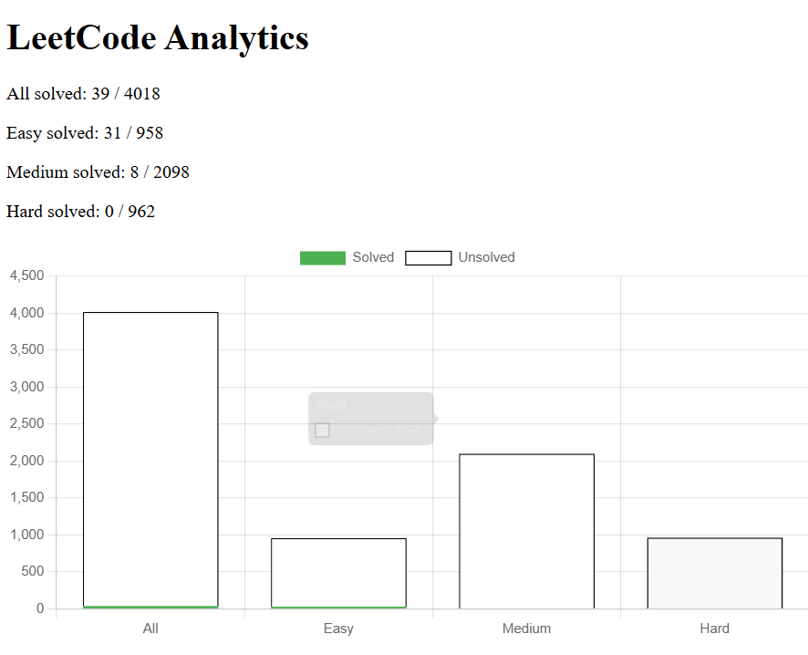
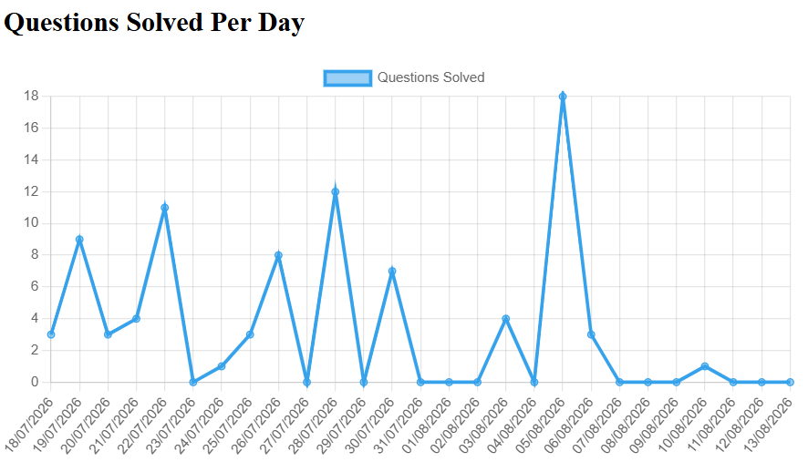
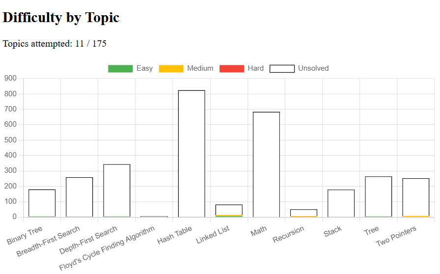

# LeetCode Performance Analytics Dashboard

## Overview

A Flask web application that connects to the LeetCode API to analyse and visualise a user's problem-solving progress.

## Features

- Overall questions solved
- Easy, Medium and Hard breakdown
- Questions solved per day
- Topic progress
- Difficulty by topic
- Solved vs unsolved questions

## Technologies

- Python
- Flask
- JavaScript
- Chart.js
- GraphQL API
- HTML/CSS

## How It Works

The application uses the LeetCode GraphQL API to retrieve user and problem data, including solved questions, difficulty levels, topic tags, submission history and streak information.

The data is processed using Python and displayed through interactive Chart.js visualisations.

## API

This project uses the [LeetCode GraphQL API](https://github.com/akarsh1995/leetcode-graphql-queries) to retrieve data from LeetCode.

## Installation

1. Clone the repository:

```bash
git clone https://github.com/lilyroberts-a/LeetCode-Dashboard.git
```

2. Navigate to the project directory:

```bash
cd LeetCode-Dashboard
```

3. (Optional but recommended) Create and activate a virtual environment:

Windows:

```bash
python -m venv .venv
.venv\Scripts\activate
```

macOS/Linux:

```bash
python3 -m venv .venv
source .venv/bin/activate
```

4. Install the required packages:

```bash
pip install -r requirements.txt
```

5. Run the application:

```bash
python app.py
```

The application will then be available at:

```text
http://127.0.0.1:5000
```

## Images









